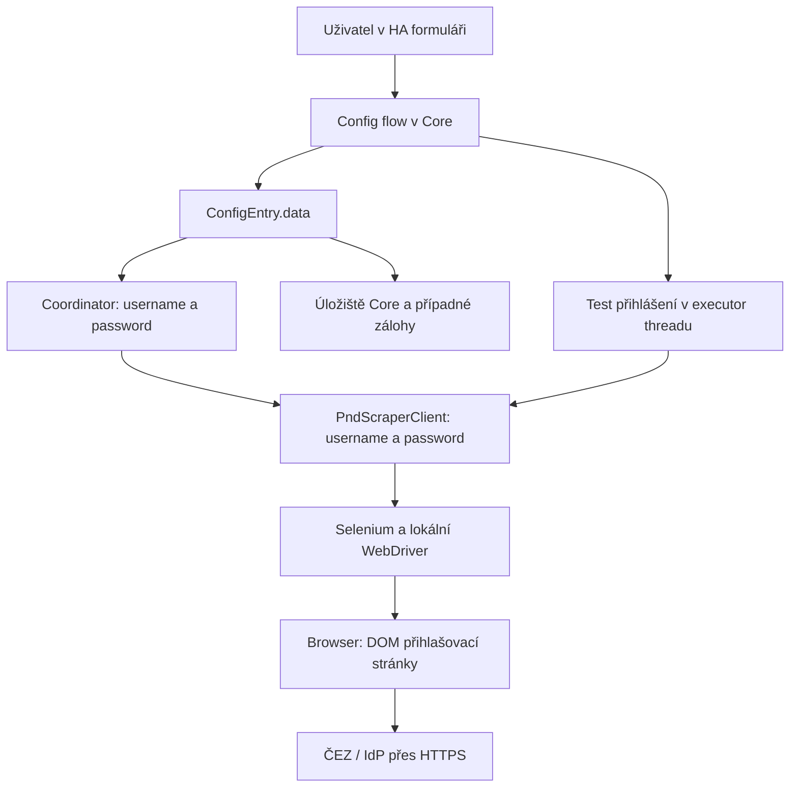
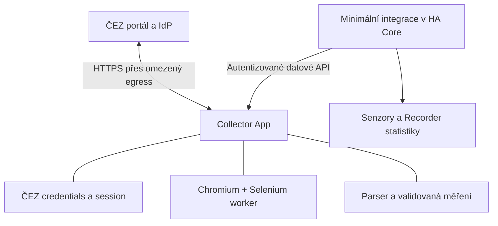

# Phase 1 — analýza bezpečné integrace ČEZ PND

**Doporučuji oddělit Collector App od Home Assistant Core. Zahájení implementace zatím blokuje chybějící projektová specifikace a neověřená proveditelnost požadované izolace.**

Analýza proběhla pouze čtením. Nevytvořil jsem soubory, větev, commit ani PR a nezahájil Phase 2. Cílový repozitář zůstal na commitu `924fa095e53db15ebd3657c4f99724d448af0b25`, bez pracovních změn.

Analyzovaný referenční strom: [igracek/HACS_CEZD_PND, commit 747e755](https://github.com/igracek/HACS_CEZD_PND/tree/747e755cad1517079f96b86a27d2ae425df5b903). Prošel jsem všechny soubory tohoto stromu, nikoli celou historii změn. Referenční kód jsem nespouštěl ani neukládal do projektu.

**Důležitý nedostatek zadání:** lokální i vzdálený cílový repozitář obsahuje jen `.gitignore` a README s názvem projektu. Autoritativní projektová specifikace v něm není. Architekturu proto hodnotím proti přiloženému zadání; shodu s další specifikací nelze potvrdit.

Použité označení:

- **CONFIRMED:** ověřeno v konkrétním zdrojovém kódu nebo dokumentaci.
- **INFERRED:** technický závěr z ověřeného podkladu, bez provozního ověření.
- **UNKNOWN:** dostupné podklady nestačí.
- **NEEDS LIVE VERIFICATION:** vyžaduje skutečný portál, síťový provoz nebo cílové prostředí.

U ČEZ znamená **CONFIRMED výskyt v kódu**, nikoli potvrzení aktuálního chování jeho serverů.

## 1. Repozitář a současná architektura

Reference je vlastní integrace HACS. Neobsahuje samostatnou Collector App, kontejnerový deployment, automatické testy ani CI workflow v analyzovaném stromu.

| Soubor / modul | Odpovědnost |
|---|---|
| `README.md` | Instalace, konfigurace, popis statistik a bezpečnosti; některá tvrzení neodpovídají kódu. |
| `LICENSE` | MIT, copyright 2026 igracek. |
| Kořenový `hacs.json` | Metadata HACS, minimum HA `2024.1.0`. |
| `custom_components/cez_pnd/hacs.json` | Duplicitní metadata, minimum HA `2026.8.0`. |
| `manifest.json` | Doména `cez_pnd`, verze `1.0.0`, `hub`, `cloud_polling`, config flow, dvě instalované závislosti. |
| `__init__.py` | Setup/unload integrace, první refresh, platformy, služby a rollback při chybě. |
| `const.py` | Konfigurace, originové stavy, povolené hosty/cesty, chybové kódy, maskování EAN/ELM. |
| `config_flow.py` | Prvotní nastavení, test přihlášení, reauth, reconfigure a options. |
| `client.py` | Selenium, inicializace browseru, přihlášení, výběr ELM, CSV exporty, kontroly originu, downloadů a debug artefaktů. |
| `coordinator.py` | `DataUpdateCoordinator`, globální browser semafor, executor, timeouty, denní plán, orchestrace parseru a statistik. |
| `parser.py` | CSV dekódování, hlavičky, jednotky, validita, intervaly, denní souhrny a limity vstupu. |
| `models.py` | Datové struktury intervalů, souhrnů a výsledku synchronizace. |
| `tariff.py` | Rozdělení VT/NT podle historie HA entity. |
| `statistics.py` | Hodinová agregace, baseline, historické opravy kumulativních sum a externí statistiky Recorderu. |
| `sensor.py` | Sedm senzorů. |
| `binary_sensor.py` | Běh synchronizace a problémový stav. |
| `services.py`, `services.yaml` | Ruční refresh a načtení vlastního období. |
| `diagnostics.py` | Redigovaná konfigurace, stav synchronizace, verze závislostí a deklarovaná „atestace“. |
| `sbom.json` | Deklarovaný inventář několika závislostí a browserové matice. |
| `translations/cs.json`, `en.json` | Překlady konfigurace, chyb a služby. |
| `.gitignore` | Ignorované lokální, dočasné a debug soubory; nejde o ochranu provozních tajemství. |

Selenium a BeautifulSoup běží jako Python knihovny **uvnitř procesu Core**. Browser a WebDriver jsou jeho podprocesy. Přesunutí blokující práce do executor threadu zamezuje části blokování event loopu, ale nevytváří bezpečnostní hranici. [Zdrojový strom](https://github.com/igracek/HACS_CEZD_PND/tree/747e755cad1517079f96b86a27d2ae425df5b903/custom_components/cez_pnd)

**Další potvrzený nesoulad:** `const.py` používá `Tuple` bez importu. Na Pythonu s okamžitým vyhodnocováním těchto anotací, například 3.12/3.13, je to překážka importu. Provozní dopad na konkrétní HA runtime nebyl ověřen; README přitom deklaruje i Python 3.12+. Rozdílné minimum HA v obou `hacs.json` zvyšuje riziko nekompatibilní instalace.

## 2. Přihlášení a autentizace

Rekonstruovaný tok podle `_login()`:

| Krok | CONFIRMED chování reference |
|---|---|
| Inicializace | Nová instance browseru pro test přihlášení nebo stahování. |
| První navigace | `https://pnd.cezdistribuce.cz/cezpnd2/external/dashboard/view` přes `driver.get()`. |
| Po navigaci | Čekání, kontrola preauth originu, detekce údržby, pokus zavřít Cookiebot banner. |
| Uživatelské pole | XPath podle dvou českých placeholderů nebo `type=email` **nebo libovolného `type=text`**. |
| Heslové pole | XPath podle českých placeholderů nebo `type=password`. |
| Submit | Vyhledání `button[type=submit]`; podmínka tříd je kvůli alternativě `@type='submit'` fakticky nezúží. |
| Vložení jména | Kontrola credential originu, `clear()`, další kontrola, `send_keys(self.username)`. |
| Vložení hesla | Kontrola credential originu, `clear()`, `send_keys(self.password)`. |
| Odeslání | Opakovaná kontrola originu, čekání na klikatelnost, kliknutí. |
| Po odeslání | Čekání, kontrola auth originu a údržby. |
| Úspěch | Přítomnost H1 obsahujícího „Naměřená data“ a následná kontrola PND originu a prefixu `/cezpnd2`. |
| Selhání | Čtení alertu a heuristiky CAPTCHA, zablokování a údržby; jinak auth chyba nebo timeout. |
| Dashboard | Pokus zavřít „Přečteno“, případný refresh, získání textu verze aplikace. |

Přesné selektory a jejich pořadí jsou doloženy v [client.py, přihlášení](https://github.com/igracek/HACS_CEZD_PND/blob/747e755cad1517079f96b86a27d2ae425df5b903/custom_components/cez_pnd/client.py#L938). **Jejich platnost na současném portálu je NEEDS LIVE VERIFICATION.**

Autentizační stavy `preauth`, `auth`, `credentials`, `idp`, `app` jsou vlastní stavy validátoru. Nejsou důkazem skutečného stavového automatu ČEZ.

**UNKNOWN / NEEDS LIVE VERIFICATION:**

- konkrétní redirect chain, jeho pořadí a HTTP statusy;
- skutečná login URL a akce formuláře;
- názvy polí v HTTP požadavku, metoda a tělo přihlášení;
- session cookies, tokeny, jejich atributy a životnost;
- způsob vytvoření serverové session;
- MFA a jiné autentizační varianty.

Reference explicitně neexportuje ani neobnovuje cookies a neimplementuje logout. Browser spravuje session během svého běhu; po operaci se volá `quit()`. **Ukončení browseru není potvrzené odhlášení serverové session.** Vypršení session uprostřed stahování nemá samostatný obnovovací tok.

## 3. Životní cyklus přihlašovacích údajů

**CONFIRMED:** uživatel zadává ČEZ jméno a heslo v HA config flow. Při úspěchu se celý `user_input` uloží do `ConfigEntry.data`. Options flow heslo odstraňuje z options, ale nové heslo zapisuje zpět do `entry.data`. Reauth dělá totéž.

Core serializuje config entries do svého úložiště `.storage/core.config_entries`; reference před uložením heslo nešifruje. Jde o aplikační uložení v JSON, nezávislé na případném šifrování disku nebo záloh. [Config flow reference](https://github.com/igracek/HACS_CEZD_PND/blob/747e755cad1517079f96b86a27d2ae425df5b903/custom_components/cez_pnd/config_flow.py), [HA config entries](https://github.com/home-assistant/core/blob/dev/homeassistant/config_entries.py), [HA storage](https://github.com/home-assistant/core/blob/dev/homeassistant/helpers/storage.py)

Hranice důvěry:

1. Uživatelský browser → HA frontend/backend.
2. Core paměť → persistentní konfigurace a zálohy.
3. Integrace → knihovna Selenium se stejnými procesními oprávněními.
4. Core → lokální WebDriver proces.
5. WebDriver → browser a jeho DOM.
6. Browser → vzdálený IdP a kód jeho stránky.
7. Chybové a diagnostické cesty → logy/exporty dostupné dalším osobám.

Heslo zůstává v paměti `ConfigEntry`, coordinatoru a scraperu. Neexistuje explicitní vymazání jeho kopií.

**Expozice:**

- Přímé běžné logování `self.password` jsem nenašel.
- Některé výjimky jsou řetězené pomocí `raise … from err`; původní informace mohou zůstat v exception chain.
- Redakce není globální pro všechny logy ani knihovny.
- Reconfigure formulář obsahuje **uložené heslo jako default**, přestože options/reauth používají prázdné pole.
- Debug metoda existuje pro DOM, screenshot a metadata, ale přijímá jen fáze začínající `pre_auth_`. Žádné nalezené produkční volání takovou fázi nepředává, takže v analyzovaných běžných chybových větvích nic nezapisuje.
- Vlastní persistentní cookie soubor není implementován. Provozní stopy v profilech browseru, swapu či crash dumpech jsou **UNKNOWN**.

## 4. Současné bezpečnostní kontroly

| Kontrola | Stav | Hodnocení |
|---|---|---|
| HTTPS | PARTIAL | Vyžadováno při kontrolách URL; nikoli politika všech browser requestů. |
| Přesný hostname | IMPLEMENTED | `urlsplit().hostname` porovnaný členstvím v konkrétní množině. |
| Port | IMPLEMENTED | Povoleno implicitní HTTPS nebo 443. |
| Origin a cesta | PARTIAL | Stavové hosty a segmentové prefixy; nikoli ověření všech cílů formuláře a JavaScriptu. |
| Redirecty | PARTIAL | Kontrola aktuální URL po navigaci; redirect není před odesláním blokován síťovou vrstvou. |
| Vložení credentials | PARTIAL | Opakované origin checks; široké selektory a neověřený formulář. |
| Selenium navigace | PARTIAL | Pevná úvodní URL, následně klikání na obsah portálu. |
| Sandbox | PARTIAL | Zákaz tří přepínačů, ale přítomen `--disable-gpu-sandbox`; skutečný sandbox se nedokazuje. |
| Non-root / oddělení oprávnění | MISSING | Žádné vynucení UID ani separace od Core. |
| Logování | PARTIAL | Většinou maskované identifikátory/chybové kódy, několik významných výjimek. |
| Redakce | PARTIAL | Funkce pro citlivé údaje a diagnostics; nepokrývají všechny výstupy. |
| Výjimky | PARTIAL | Typované chyby, ale široké catch bloky a potlačování některých selhání. |
| Outbound síť | MISSING | Žádný request interceptor ani síťový deny-by-default. |
| Závislosti | PARTIAL | Verze v rozsazích a statický SBOM; žádný reprodukovatelný uzamčený runtime. |
| Secrets storage | MISSING | ČEZ heslo je uložené v Core. |
| Path traversal | PARTIAL | Kontrola debug cest a pevných CSV názvů. |
| Symlinky | PARTIAL | Kontroly existují, ale nejsou konzistentní a zůstávají závody mezi kontrolou a použitím. |

Podklady: [client.py](https://github.com/igracek/HACS_CEZD_PND/blob/747e755cad1517079f96b86a27d2ae425df5b903/custom_components/cez_pnd/client.py), [diagnostics.py](https://github.com/igracek/HACS_CEZD_PND/blob/747e755cad1517079f96b86a27d2ae425df5b903/custom_components/cez_pnd/diagnostics.py).

## 5. Bezpečnostní nálezy

Závažnost hodnotí dopad proti požadovanému cíli. Pravděpodobnost je kvalitativní **INFERRED**, nikoli výsledek penetračního testu. Žádný doložený nález zde neoznačuji CRITICAL.

| Závažnost | Nález a důkaz | Dopad | Pravděpodobnost | Doporučené opatření |
|---|---|---|---|---|
| **HIGH** | ČEZ credentials v `ConfigEntry.data`, coordinatoru a scraperu. | Kompromitace Core nebo jeho konfigurace zpřístupní ČEZ účet. | Vysoká podmíněně při kompromitaci Core. | Credentials přijímat a uchovávat jen v Collectoru; žádný endpoint pro jejich čtení. |
| **HIGH** | Selenium běží v Core; browser je jeho podproces. | Škodlivá Python závislost má přístup ke Core; browser escape může rozšířit dopad. | Střední, závislá na exploitaci. | Samostatný omezený Collector, ideálně dále oddělený browser worker. |
| **HIGH** | Validace `current_url` neomezuje form action, subresources, fetch, websockety ani mezilehlé redirecty. | Exfiltrace nebo přístup k interním službám při škodlivé stránce. | Střední při kompromitaci stránky/dependency. | Kontroly formuláře plus browser request policy a nezávislé egress omezení. |
| **HIGH** | Sandbox diagnostika odvozuje „verified“ z nepřítomnosti několika flagů; některé chyby inspekce ignoruje. Přítomen `--disable-gpu-sandbox`. | Falešný pocit izolace a možné oslabení obrany. | Střední; skutečný runtime neověřen. | Vynutit non-root a doložit aktivní sandbox; nedostatek důkazu = neúspěšný start. |
| **HIGH** | Download adresáře dostávají `0777`; parser má fallback na pevnou cestu po odmítnutí symlinku. | Jiný místní proces může podvrhnout měření nebo zpřístupnit čtení nežádoucího souboru. | Střední při přítomnosti lokálního útočníka. | Soukromé adresáře, kontrolované file descriptory, zákaz následování symlinků při otevření. |
| **HIGH — integrita** | `parser.parse()` potlačí chybu jednoho profilu a chybějící hodnoty doplní jako platnou nulu. | Tichá ztráta spotřeby/dodávky a chybná historická data. | Střední až vysoká při změně exportu. | Rozlišit „neexistuje tento kanál“, „chybí data“ a „parser selhal“; nikdy je neslévat do nuly. |
| **MEDIUM** | `statistics.py` loguje celé `statistic_id`, které obsahuje EAN. Služby vracejí EAN ve výjimkách. | Únik citlivého identifikátoru do logů a podpory. | Vysoká při běžném importu statistik. | Opaque ID nebo důsledně redigovaný logovací identifikátor. |
| **MEDIUM** | Parser loguje některé syrové hlavičky/statusy; client loguje některé výjimky přímo. | Únik dat z nedůvěryhodného vstupu, manipulace s logy; možnost zachování tajemství v exception chain. | Střední; konkrétní únik hesla neprokázán. | Strukturované kódy, limity textu a redakce na výstupní hranici. |
| **MEDIUM** | Reconfigure předvyplňuje původní heslo. | Další zpřístupnění hesla prezentační vrstvě konfigurace. | Vysoká při použití tohoto toku. | Prázdné pole a explicitní sémantika „zachovat stávající“. |
| **MEDIUM** | `last_sync_time` se mění i při chybě; chybí samostatné `last_success` a maximální stáří dat. | Čerstvý pokus lze zaměnit za čerstvá data. | Vysoká při výpadcích. | Oddělit pokus, úspěch, poslední měření a úplnost. |
| **MEDIUM** | Timeout neomezuje čekání na globální semafor; zastavení workeru je kooperativní. | Zaseknutý WebDriver může blokovat další účty. | Střední. | Procesový worker s tvrdým limitem a kontrolovaným ukončením celé skupiny procesů. |
| **MEDIUM** | Široké dependency constraints, neúplný SBOM a diagnostická „atestace“ bez kontroly instalovaných hashů. | Nepředvídatelná instalace a supply-chain riziko. | Střední. | Reprodukovatelné buildy, skutečný SBOM, podpisy a aktualizační politika. |
| **LOW** | Existuje regex sanitizace HTML a nesanitizovaný screenshot, ale současná volání debug writer neaktivují. | Latentní únik po budoucí změně volání. | Nízká v analyzovaném toku. | Výchozí zákaz artefaktů; případně pouze explicitně schválené strukturované diagnostiky. |

Důkazy jsou v [client.py](https://github.com/igracek/HACS_CEZD_PND/blob/747e755cad1517079f96b86a27d2ae425df5b903/custom_components/cez_pnd/client.py), [parser.py](https://github.com/igracek/HACS_CEZD_PND/blob/747e755cad1517079f96b86a27d2ae425df5b903/custom_components/cez_pnd/parser.py), [statistics.py](https://github.com/igracek/HACS_CEZD_PND/blob/747e755cad1517079f96b86a27d2ae425df5b903/custom_components/cez_pnd/statistics.py) a [config_flow.py](https://github.com/igracek/HACS_CEZD_PND/blob/747e755cad1517079f96b86a27d2ae425df5b903/custom_components/cez_pnd/config_flow.py).

**Výslovně nepotvrzené útoky:** v ČEZ portálu nebyl prokázán open redirect, XSS ani kompromitace. Substringová validace hostname se v reference nepoužívá. Neexistuje potvrzený veřejný vstup „stáhni libovolnou URL“; SSRF riziko zde plyne z neomezeného browseru ovládaného nedůvěryhodným webovým obsahem.

## 6. Získávání naměřených dat

**CONFIRMED:** jde o automatizované ovládání portálu a stahování CSV.

1. Přihlášení.
2. Přepnutí na „Tabulka dat“.
3. Volba „Rychlá sestava“ a ELM.
4. Volba „Včera“ nebo vlastního období.
5. Kliknutí „Vyhledat data“.
6. Výběr sestavy.
7. „Exportovat data“ → „CSV“.
8. Čekání na nový dokončený soubor.
9. Kontrola souboru a CSV parser.

Reference hledá následující názvy sestav:

| Účel | Názvy používané v kódu |
|---|---|
| Intervalová spotřeba | `01 Profil spotřeby (+A)` a textové varianty. |
| Intervalová dodávka | `02 Profil výroby (-A)` a varianty. |
| Denní spotřeba | `07 Profil spotřeby za den (+A)`, alternativně `17 Registry za den (+E, -E)`. |
| Denní dodávka | `08 Profil výroby za den (-A)`. |

BeautifulSoup slouží ke čtení nabídek ELM z `driver.page_source`. Měření se nezískávají parsováním HTML tabulky pomocí BeautifulSoup. JavaScript spuštěný integrací především posouvá prvky a provádí fallback kliknutí. [Datový tok klienta](https://github.com/igracek/HACS_CEZD_PND/blob/747e755cad1517079f96b86a27d2ae425df5b903/custom_components/cez_pnd/client.py#L1307)

**Endpoint `POST /cezpnd2/external/data`:**

| Položka | Závěr |
|---|---|
| Výskyt cesty v celém zdrojovém stromu | **CONFIRMED: nenalezen.** |
| Existence endpointu na ČEZ | **UNKNOWN / NEEDS LIVE VERIFICATION.** |
| Metoda POST | **UNKNOWN.** |
| Parametry, tělo, hlavičky | **UNKNOWN.** |
| Cookies a CSRF token | **UNKNOWN.** |
| Response type a chybové odpovědi | **UNKNOWN.** |
| EAN/ELM nebo interní ID v požadavku | **UNKNOWN.** |

Kód neobsahuje přímého HTTP klienta pro ČEZ datové API. Síťové požadavky generované JavaScriptem samotného portálu z reference rekonstruovat nelze.

Parser očekává CSV s datem, měřicí hodnotou a případně stavem validity, podporuje několik kódování a oddělovačů. Jde o **potvrzená očekávání parseru**, nikoli ověřenou specifikaci ČEZ exportu.

## 7. EAN a ELM

| Oblast | EAN | ELM |
|---|---|---|
| Konfigurace | HA formulář, kontrola 18 číslic. | HA formulář, alfanumerický formát do 30 znaků, `-` a `_`. |
| Persistence | `ConfigEntry.data`, také unique ID config flow. | `ConfigEntry.data`. |
| Použití vůči ČEZ | Přímé odeslání EAN jsem nenašel. | Výběr položky v DOM portálu. |
| Identita měření | Použitý jako lokální identita a prefix statistik. | Použitý k výběru elektroměru. |
| Logy | Maskování na některých místech; celý EAN v logovaných statistikách a výjimkách služeb. | Běžná explicitní logování maskují ELM. |
| Entity | Celý EAN v `unique_id` a device identifier. | Vlastní atribut ELM nenalezen. |
| Diagnostika | Konfigurační klíč redigován. | Konfigurační klíč redigován. |

**Zásadní chybějící kontrola:** reference neověřuje, že vybraný ELM skutečně patří ke konfigurací zadanému EAN. Chybná dvojice tak může označit měření nesprávnou lokální identitou.

Extra state attributes přímo EAN/ELM nevracejí. To však neodstraňuje EAN z registrů a statistik. Skutečné `entity_id` přiděluje HA; seznam v README není zárukou jejich přesného tvaru. [Config flow](https://github.com/igracek/HACS_CEZD_PND/blob/747e755cad1517079f96b86a27d2ae425df5b903/custom_components/cez_pnd/config_flow.py), [výběr ELM](https://github.com/igracek/HACS_CEZD_PND/blob/747e755cad1517079f96b86a27d2ae425df5b903/custom_components/cez_pnd/client.py#L1104), [entity](https://github.com/igracek/HACS_CEZD_PND/blob/747e755cad1517079f96b86a27d2ae425df5b903/custom_components/cez_pnd/sensor.py)

## 8. Plánování, aktualizace a statistiky

**Plánování — CONFIRMED:**

- `DataUpdateCoordinator(update_interval=None)`.
- První synchronizace při setupu.
- Denní callback přes `async_track_time_change`, výchozí čas `06:00`.
- Ruční služba `cez_pnd.fetch_data`.
- Vlastní období: rozdíl koncového a počátečního data nejvýše 60 dní; u inkluzivního intervalu to může znamenat 61 kalendářních dnů.
- Údržba: další pokus za 3 600 sekund.
- Page-load a script timeout 30 sekund.
- Test/synchronizace: async timeout 180 sekund, interní deadline 175 sekund.
- Globálně nejvýše jeden browser worker.
- Čekání na semafor leží mimo 180sekundový timeout.

Chybí samostatný poslední úspěch, politika maximálního stáří a trvalý přehled nevyplněných období. Při denní chybě vzniká nový chybový `last_sync_result`; běžná nedostupnost entit se opírá o coordinator. Ruční historická chyba má jiný tok a nepublikuje nový stav stejným způsobem. [Coordinator](https://github.com/igracek/HACS_CEZD_PND/blob/747e755cad1517079f96b86a27d2ae425df5b903/custom_components/cez_pnd/coordinator.py)

**Senzory a statistiky — CONFIRMED:**

- Čtyři energetické senzory mají `device_class=energy`, jednotku `kWh`, bez `state_class=total` či `total_increasing`.
- Poměr a trvání synchronizace používají `measurement`.
- Externí statistiky zahrnují spotřebu celkem, VT, NT a dodávku.
- Intervaly se seskupují do UTC hodin.
- Hodina se přijme jen se čtyřmi platnými intervaly.
- `state` je hodinová energie; `sum` kumulativní energie.
- Historické opravy přepočítají dávku a posunou následné sumy.
- Kontrolují se záporné delty a monotónnost. [Statistiky](https://github.com/igracek/HACS_CEZD_PND/blob/747e755cad1517079f96b86a27d2ae425df5b903/custom_components/cez_pnd/statistics.py)

**Problémy správnosti:**

1. **Potvrzené doplňování chybných/chybějících profilů platnou nulou.**
2. **DST:** parser vytváří naive datetime a deduplikuje podle lokálního času. Opakovanou podzimní hodinu neumí jednoznačně reprezentovat. Skutečný formát ČEZ pro DST je neověřen.
3. **Časové pásmo:** chybí explicitní smlouva mezi časem ČEZ, HA a lokálním časem procesu.
4. **„Intervalový“ senzor sčítá všechny intervaly výsledku**, ne posledních 15 minut.
5. Po historickém refreshi mohou „včerejší“ senzory zobrazovat součet celého zadaného období.
6. „Pokrytí spotřeby výrobou“ se počítá jako dodávka/odběr; bez dalších měření to nedokazuje vlastní výrobu ani soběstačnost.
7. Chybějící tarifní historie se převádí na VT. Je to odhad, nikoli potvrzená tarifní informace.
8. Přechod VT/NT uvnitř intervalu se řeší většinovým časem, nikoli skutečnou energií v jednotlivých tarifech.
9. Parser přijímá prázdný status jako validní a neověřuje explicitně skutečnou budoucnost časové značky.
10. Podpora registrů `+E/-E` nedokládá správné odlišení kumulativního stavu registru od denní energie.
11. Čtyři statistické proudy se zapisují odděleně; atomická transakce celé synchronizace není zaručena.
12. Při chybějícím importním API existují fallback větve, které mohou skončit bez skutečného zápisu a bez chyby.

## 9. Selhání a jejich obsluha

| Scénář | Současná obsluha |
|---|---|
| Neplatné credentials | `PndAuthError`; u běžného refresh toku `ConfigEntryAuthFailed` a reauth. |
| Jiná auth chyba | Často stejný auth kód; může zahrnovat i nepovolený origin nebo změněný formulář. |
| Expirace session | Bez samostatné obnovy; nepřímá chyba dalšího kroku. |
| Timeout | Částečně řízený deadline a teardown; nejde o tvrdé ukončení executor threadu. |
| Portál nedostupný | Obecná browser/scraper/timeout chyba; bez obecného backoffu. |
| Pád browseru/WebDriveru | Exception handling a pokus o teardown; ne ve všech částečně dokončených inicializačních větvích prokazatelně úplný. |
| Neočekávaný redirect | Odmítnutí při následující origin kontrole; předchozí request mohl proběhnout. |
| Změněné HTML/selektor | Fallback selektory, retry smyčky, poté timeout/auth/scraper chyba. |
| Malformované CSV | Limity a validace existují; chyba jednoho profilu však může být potlačena. |
| CAPTCHA | Textová heuristika po neúspěšném čekání na dashboard; bez řešení CAPTCHA. |
| Zamčený účet | Textová heuristika; bez specifické dlouhodobé blokace dalších pokusů. |
| Údržba | Dvě české textové fráze; běžný refresh plánuje retry za hodinu. |
| Stará data | Bez explicitního stale threshold a posledního úspěšného měření. |

Heuristiky mohou mít falešně pozitivní i negativní výsledky. Nalezení textu „robot“ například nepotvrzuje konkrétní CAPTCHA stav.

## 10. Licence a opětovné použití

**CONFIRMED:**

- `LICENSE`: **MIT**, copyright **2026 igracek**.
- README a GitHub metadata uvádějí MIT.
- Python hlavičky neobsahují jinou explicitní licenci.
- **SBOM ale označuje samotný projekt jako Apache-2.0** a obsahuje odlišný repository owner v PURL.

To je metadata rozpor, který nesmí být přenesen do nového projektu. Primární explicitní licenční soubor uděluje MIT oprávnění; SBOM neprokazuje původ všech jednotlivých příspěvků. [LICENSE](https://github.com/igracek/HACS_CEZD_PND/blob/747e755cad1517079f96b86a27d2ae425df5b903/LICENSE), [SBOM](https://github.com/igracek/HACS_CEZD_PND/blob/747e755cad1517079f96b86a27d2ae425df5b903/custom_components/cez_pnd/sbom.json)

MIT dovoluje použití, změny a redistribuci při zachování copyright a licenčního oznámení v kopiích nebo podstatných částech. Nevyžaduje zveřejnění zdrojů odvozeného projektu ani stejnou licenci celého výsledku. [Podmínky MIT](https://choosealicense.com/licenses/mit/)

| Kategorie | Rozhodnutí |
|---|---|
| **A. Potenciálně znovupoužitelný kód** | Vlastní kód reference pod MIT, po ověření původu a zachování oznámení. Technicky jej nedoporučuji přebírat jako celek. |
| **B. Nezávislá reimplementace** | Oddělení collector/client, práce s intervaly, CSV validace, plánování, princip externích statistik. Chování ČEZ ověřit samostatně. |
| **C. Nepřebírat** | Neověřená bezpečnostní tvrzení, SBOM hashe/verze jako skutečnost, rozporná licenční metadata, osobní údaje nebo případný obsah třetích stran bez práv. |

**Licence cílového projektu je UNKNOWN.** Architektonická kompatibilita není problém MIT; finální licenční kompatibilitu celé distribuce nelze uzavřít bez zvolené licence a skutečného inventáře balíků.

## 11. Závislosti

| Závislost | Constraint / evidence | Úloha a bezpečnost | Současně / cílově |
|---|---|---|---|
| Selenium | `>=4.15.0,<5.0.0` | Kritické ovládání browseru a přenos credentials. | Core → Collector. |
| BeautifulSoup4 | `>=4.12.0,<5.0.0` | Parsování DOM nabídky ELM. | Core → Collector. |
| Chromium / Chrome | Bez vynucené verze balíku | Spouští vzdálený JavaScript, drží credentials/session. | Podproces Core → Collector. |
| ChromeDriver | Bez vynucené verze | Ovládá browser; kritická lokální služba. | Podproces Core → Collector. |
| Firefox / GeckoDriver | Neuzamčený fallback | Alternativní browserový stack a další bezpečnostní rozsah. | Reference ano; pro první cílovou verzi nedoporučuji. |
| Home Assistant | Rozporné minimum `2024.1.0` / `2026.8.0` | Host integrace, Recorder, konfigurace. | Zůstává Core. |
| Voluptuous | Přímý import, bez vlastního constraintu | Konfigurační validace. | V Core; Collector si zvolí vlastní validátor. |
| `urllib3`, `certifi` | V SBOM 2.2.3 / 2024.8.30, nikoli lock | Síťová komunikace Selenium a CA bundle. | Selenium větev → Collector. |
| `trio`, `trio-websocket`, `typing_extensions`, `websocket-client` | Metadata Selenium 4.25.0 | Další runtime závislosti. | Selenium větev → Collector. |
| `soupsieve` | Metadata BS4 4.12.3: `>1.2` | Selektorová závislost BS4. | Collector. |

Manifest má široké rozsahy. SBOM uvádí Selenium 4.25.0 a BS4 4.12.3, ale nedokazuje jejich skutečnou instalaci. Metadata těchto verzí potvrzují další závislosti, které SBOM neuvádí. Úplný tranzitivní strom je **UNKNOWN**, protože chybí lock a runtime inventář. Volitelné BS4 extras, například `lxml`, reference nevyžaduje. [Manifest](https://github.com/igracek/HACS_CEZD_PND/blob/747e755cad1517079f96b86a27d2ae425df5b903/custom_components/cez_pnd/manifest.json), [Selenium metadata](https://pypi.org/pypi/selenium/4.25.0/json), [BS4 metadata](https://pypi.org/pypi/beautifulsoup4/4.12.3/json)

Pokud není nalezen explicitní driver, reference volá standardní konstruktor Selenium. **INFERRED:** podle verze a prostředí může zasáhnout Selenium Manager, včetně správy/stahování binárek. V Collectoru mají být browser a driver součástí ověřeného buildu; runtime download není vhodný. [Selenium Manager](https://www.selenium.dev/documentation/selenium_manager/)

Nebyl proveden úplný CVE audit konkrétní instalace; označení „advisory compliant“ v diagnostice jej nenahrazuje.

## 12. Doporučená cílová architektura

Rozdělení ze zadání je správný základ:

**INFERRED:** tato architektura odstraní credentials a Selenium z Core, pokud zároveň platí:

- HA config flow přijímá pouze adresu Collectoru, lokální API credential a lokální identitu měření.
- ČEZ jméno/heslo se nezadává prostřednictvím integračního flow.
- Datové API nikdy nevrací credentials, cookies, DOM ani browserové ladicí rozhraní.
- Core nemá mount na Collector secrets.
- Python balíky Selenium/BS4 nejsou závislostí minimální integrace.
- Migrační tok nezanechá původní heslo v Core.

**Omezení záruky:** společný Supervisor, hostitel, zálohy a administrátorské rozhraní zůstávají důvěryhodnou vrstvou. Samostatná App sama nedokazuje, že kompromitovaný Core s přístupem k management funkcím nemůže získat vyšší oprávnění nebo podvrhnout credential UI.

Požadavek „Core credentials běžně neuchovává“ je slabší než „credentials jsou bezpečné i při plné kompromitaci Core“. Druhý cíl potřebuje další návrh a případně odděleného hostitele.

## 13. Collector a omezení Supervisor prostředí

| Požadavek | Posouzení |
|---|---|
| Non-root služba | Realizovatelný návrhový cíl; nutno určit vlastnictví `/data` a ověřit UID skutečných procesů. |
| Chromium sandbox zapnutý | Povinný experiment v cílovém HA OS/kernel/AppArmor prostředí; zatím neprokázáno. |
| Tři zakázané flags | Převzít jako absolutní zákaz, navíc nepřebírat `--disable-gpu-sandbox`. |
| Bez privilegovaného kontejneru | Zachovat protection mode a nepřidávat široká oprávnění. |
| Bez host networking | Interní síť je pro datové API použitelná. |
| Bez `/config`, `/ssl`, Docker socketu | Pro tento návrh nejsou potřebné. |
| Bez host PID/IPC | Zachovat izolované namespaces. |
| Bez zbytečného Supervisor API | Nepožadovat rozšířená management oprávnění. |
| Persistentně jen `/data` | Odpovídá běžnému App modelu; browser potřebuje také řízený dočasný prostor. |
| Žádný libovolný outbound | **Nevyřešený podstatný konflikt:** samotná App konfigurace ani kontrola URL takovou záruku nedávají. |

Supervisor nabízí samostatně nastavitelné mounty, oprávnění, síť a AppArmor; `/data` je vlastní persistentní mount. To umožňuje úzké nastavení, ale **nedokazuje funkční browser sandbox**. [Konfigurace Apps](https://developers.home-assistant.io/docs/apps/configuration/)

Technické konflikty, které se nesmějí obejít oslabením:

1. Chromium může potřebovat funkční user namespaces a odpovídající seccomp/AppArmor politiku. Pokud sandbox nefunguje, výsledkem má být blokovaný start, nikoli `--no-sandbox`.
2. Omezování síťového provozu uvnitř kompromitovatelného Collectoru není nezávislá ochrana. Přidání `NET_ADMIN` pro vlastní firewall by měnilo bezpečnostní model.
3. Pouhé nastavení browser proxy lze obejít, pokud zůstane přímý egress povolen.
4. Supervisor poskytuje některé výchozí API operace i bez rozšířeného `hassio_api`. „Nepotřebujeme API“ není totéž jako „žádná dostupná API plocha“. [Komunikace Apps](https://developers.home-assistant.io/docs/apps/communication/)
5. Zadání credentials přes Supervisor options nebo HA Ingress rozšiřuje cestu tajemství o management/UI infrastrukturu.

## 14. Předběžný model hostů a originů

**Toto není finální allowlist.**

| Host | Účel podle reference | Fáze | Credentials podle kódu? | Cookies/session | Evidence / jistota |
|---|---|---|---|---|---|
| `pnd.cezdistribuce.cz` | Vstupní stránka a aplikace PND | Preauth, auth, app | **Ne** v credential stavu | Browser může spravovat příslušné cookies; konkrétní neznámé | **CONFIRMED v kódu**, reálný provoz neověřen |
| `mepas.cez.cz` | Povolený IdP host | Preauth, auth, credentials/idp | Ano za host/path kontroly | Názvy a atributy neznámé | **CONFIRMED v kódu**, skutečná role NEEDS LIVE VERIFICATION |
| `dip.cezdistribuce.cz` | Povolený IdP host | Preauth, auth, credentials/idp | Ano za host/path kontroly | Názvy a atributy neznámé | **CONFIRMED v kódu**, skutečná role NEEDS LIVE VERIFICATION |

Referenční path kontrakty:

- `mepas.cez.cz`: `/cas`, `/idp`, `/login`.
- `dip.cezdistribuce.cz`: `/login`, `/cezpnd2`, `/idp`.
- Aplikace PND: `/cezpnd2`.

Tyto prefixy jsou **deklarace autora reference**, ne potvrzené autentizační endpointy ČEZ. [Originové konstanty](https://github.com/igracek/HACS_CEZD_PND/blob/747e755cad1517079f96b86a27d2ae425df5b903/custom_components/cez_pnd/const.py)

Další URL v repozitáři míří na GitHub, HACS, badge služby, Home Assistant a schema SBOM. Nejde o potvrzené destinace browseru během autentizace ČEZ.

**Konceptuální strategie:**

- Parsovat URL standardním parserem, porovnávat přesný kanonický hostname.
- Jen HTTPS a explicitně povolený port.
- Odmítnout userinfo a nejednoznačné/neočekávané reprezentace URL.
- Stavově omezit cesty na ověřené segmenty, podle potřeby i query parametry.
- Před vložením hesla ověřit dokument, správný formulář, cílový action a kontext prvků.
- Povolit jen zdokumentované přechody mezi autentizačními stavy.
- Omezit redirecty i síťové requesty **před jejich odesláním**.
- Oddělit hosty pro credentials od hostů pouze pro statické zdroje.
- Nezávisle zabránit přístupu browseru k loopbacku, LAN, metadatovým službám a Collector API, s výslovnými výjimkami jen pro nezbytné lokální řízení.
- Ověřit DNS, IPv6, přímé IP adresy, websockety a další možné obcházení egress pravidel.

Ani přesný allowlist nezabrání zneužití credentials JavaScriptem na kompromitovaném **povoleném** IdP.

## 15. Lokální API Collectoru

Navržené cesty jsou návrhem projektu, nikoli existujícími endpointy reference.

| Endpoint | Doporučení |
|---|---|
| `GET /api/v1/health` | Jednoduchá liveness odpověď bez účtu či měření; lze řešit odděleným interním healthcheckem. |
| `GET /api/v1/status` | Potřebný pro poslední pokus, úspěch, chybu, stav běhu a stáří dat. |
| `GET /api/v1/consumption/latest` | Volitelný; lze odvodit z measurements, hrozí duplicitní sémantika. |
| `GET /api/v1/measurements` | Hlavní datové API; omezený rozsah, stránkování a explicitní úplnost. |
| `POST /api/v1/refresh` | Užitečný, ale asynchronní, sloučený při souběhu a omezený frekvencí. |

**Doporučený základ — návrh:**

- Náhodný API token vytvořený Collectorem, například 256 bitů entropie.
- Core uchovává pouze tento omezený credential, nikdy ČEZ heslo.
- Collector může ukládat verifier tokenu; nezbytný originál při párování zpřístupnit jednorázově.
- Token nepředávat v URL, nelogovat jej, redigovat diagnostics.
- Datový token nesmí umožňovat změnu ČEZ credentials, libovolnou navigaci ani administraci.
- Bind na interní kontejnerovou síť, bez publikace portu na LAN. Samotný loopback Collectoru pro Core v jiném kontejneru nestačí.
- Omezení velikostí odpovědí, rozsahu dat, souběhu a refreshů.
- Odmítnout neznámé parametry, libovolné URL a souborové cesty.
- Nepovolovat CORS pro libovolné weby.
- Bearer token je opakovaně použitelný: pro ochranu před odposlechem na nedůvěryhodné síti potřebuje TLS, případně mTLS. Nešifrovanou interní síť nelze vydávat za kryptografickou ochranu.
- CSRF je méně přímočaré u hlavičkového tokenu bez cookies; u cookie/Ingress administračního UI je potřeba samostatná ochrana.

**Porovnání transportů:**

| Varianta | Posouzení |
|---|---|
| Lokální omezený API token | Nejjednodušší kontrolovatelná varianta pro Core → Collector; zůstává potřeba bezpečného párování a transportu. |
| Supervisor Ingress | Reálně dostupná autentizace uživatelského UI; není doložen jako univerzální náhrada server-to-server API pro integraci. |
| Collector → Core přes Supervisor proxy | Reálně dostupné, ale opačný směr a přidává Collectoru oprávnění k Core API. |
| Supervisor stdin | Reálně existuje pro příkazy, nikoli vhodná plná náhrada dotazovacího datového API. |
| mTLS | Silnější vzájemná autentizace, větší nároky na provisioning a rotaci; nejde o automatickou službu Supervisoru pro vlastní API. |

Ingress má vlastní omezení zdroje spojení a autentizaci uživatele. **Pokud má být tajemství izolované i od kompromitovaného Core/UI, nelze bez dalšího použít HA rozhraní k zadávání ČEZ hesla.** [Ingress](https://developers.home-assistant.io/docs/apps/presentation/#ingress), [App security](https://developers.home-assistant.io/docs/apps/security/)

## 16. Předběžný threat model

**Aktiva:** ČEZ jméno/heslo, autentizovaná session, cookies/tokeny, EAN/ELM, měření, Collector API token, správnost historických statistik.

| Aktér / selhání | Primární cesta útoku | Ochrana a zbytkové riziko |
|---|---|---|
| Kompromitovaný ČEZ portál | Škodlivý DOM/JS, podvržené měření, exfiltrace | Validace a egress omezí dopad; legitimní IdP stále vidí zadané heslo. |
| Škodlivý redirect | Přesun na cizí nebo interní službu | Předběžná request kontrola; nestačí následné `current_url`. |
| Škodlivá Python závislost | Čtení Collector paměti a `/data` | Build/release kontrola a izolace; závislost v secret procesu má přímý přístup. |
| Kompromitovaný Chromium | Krádež session, útok na lokální služby/soubory | Sandbox, samostatná práva browser workeru, síťové oddělení. |
| Kompromitovaný Collector | Čtení credentials, falšování dat | Core nesmí důvěřovat neomezeným odpovědím; credentials v Collectoru nelze před plnou kompromitací jeho procesu zcela chránit. |
| Kompromitovaný Core | Krádež datového tokenu, refresh DoS, útok na management/UI | Omezené API a žádné secrets; síla izolace závisí na Supervisor oprávněních. |
| Síťový útočník | Odposlech/podvržení API, DNS útoky | TLS, ověření peer identity a řízený egress. |
| Škodlivá App aktualizace | Nový kód přečte existující secrets | Podepsané a kontrolované buildy; podpis sám nezaručuje bezpečný obsah. |
| Chyba administrátora | Publikace portu, vypnutí ochrany, sdílení záloh/logů | Bezpečné výchozí nastavení a detekce odchylky. |

Hlavní plochy útoku jsou přihlašovací stránka, WebDriver/CDP, parser exportů, datové API, credential onboarding, `/data`, aktualizace a zálohy.

**Bezpečnostní předpoklady musí být schváleny:** zda jsou hostitel a Supervisor důvěryhodné; zda je v rozsahu kompromitovaný Core; zda je interní síť důvěryhodná; kdo může měnit instalované obrazy a exportovat zálohy.

Zbytková rizika zahrnují kompromitaci povoleného IdP, chybná zdrojová měření, zranitelnost kernelu a škodlivou aktualizaci s legitimním přístupem k persistentním secrets.

## 17. Migrační plán

Jde pouze o návrh budoucí migrace.

1. **Inventarizace:** zmapovat config entry, `unique_id`, skutečné `entity_id`, device identifiers a čtyři statistic IDs.
2. **Oddělené zprovoznění Collectoru:** credentials zadat nově jeho určeným bezpečným kanálem; nepřenášet automaticky původní heslo přes Core.
3. **Ověření identity:** potvrdit EAN ↔ ELM a sémantiku exportovaných kanálů.
4. **Porovnání dat:** několik dní ověřit součty a intervaly bez paralelního zápisu do stejných statistik.
5. **Přepnutí jediného zapisovatele:** původní scraper zastavit před aktivací importu nové integrace.
6. **Migrace konfigurace:** zachovat nebo řízeně převést identity, odstranit username/password ze starých dat i případných options.
7. **Vyčištění paměti:** ukončit staré workery a browsery; restart Core po odstranění staré integrace omezí přetrvávání objektů s heslem.
8. **Historické kopie:** řešit staré zálohy, logy, profily a artefakty. Odstranění aktivního config entry nevymaže existující zálohy.
9. **Rotace ČEZ hesla:** znehodnotit původní credential; případné zneplatnění session závisí na možnostech ČEZ.
10. **Kontinuita statistik:** zachovat staré statistic IDs, nebo provést explicitní migrační mapování a kontrolu sum. Nespouštět dva importéry stejné série.

**Kompromis identity:** zachování `cez_pnd:<ean>_*` pomáhá kontinuitě, ale zachovává citlivý EAN v HA. Nová opaque ID vyžadují promyšlenou migraci.

**Rollback:** návrat k původní integraci s ČEZ heslem v Core porušuje cílový bezpečnostní model. Bezpečný rollback má vracet předchozí verzi nové architektury nebo ponechat data dočasně nedostupná. Obnova staré HA zálohy může credentials znovu zavést.

## 18. Závěrečné rozhodnutí

### Architecture recommendation

Samostatná Collector App a minimální integrační klient v Core. Credentials, session, Selenium a browser pouze v Collectoru; statistiky a HA entity v Core. Pro silnou ochranu před kompromitovaným Core navíc vyřešit management a onboarding hranici.

### Most important confirmed findings

- Reference ukládá ČEZ credentials v Core.
- Data získává přes browserové CSV exporty.
- Má přesnou hostname validaci, ale nemá úplné síťové omezení browseru.
- Parser může převést selhání profilu na platné nuly.
- EAN uniká do některých logů.
- Bezpečnostní diagnostika neprokazuje skutečný sandbox.

### Top security risks

Credentials v Core, neomezený egress, nedoložený sandbox, world-writable download adresáře, tiché poškození dat a neuzamčené závislosti.

### License/reuse decision

MIT reuse je podmíněně možný při zachování oznámení. Doporučuji nezávislou implementaci a nepřebírat rozporný SBOM ani bezpečnostní tvrzení.

### Confirmed CEZ hosts/endpoints

**Potvrzeno v reference:** `pnd.cezdistribuce.cz`, `mepas.cez.cz`, `dip.cezdistribuce.cz` a vstupní dashboard URL.

**Datové API endpointy potvrzeny nejsou.** Pro `POST /cezpnd2/external/data` nebyl nalezen důkaz.

### Items requiring live portal verification

Redirect chain, login form/action, session a CSRF mechanismus, skutečné request destinace, exportní požadavky, EAN/ELM vazba, význam kanálů a jednotek, časové pásmo/DST, CAPTCHA, expirace session a chybové stavy.

### Blocking unknowns

- Chybějící autoritativní specifikace.
- Požadovaná síla ochrany vůči kompromitovanému Core/Supervisoru.
- Funkční Chromium sandbox v cílovém prostředí.
- Nezávislé vynucení omezeného egressu.
- Bezpečný onboarding credentials a párování API.
- Ověřený datový kontrakt ČEZ.

### Recommended Phase 2 scope

Po doplnění rozhodnutí nejprve ověřit runtime izolaci a síťový model, potom zavést úzký Collector a datový kontrakt. Teprve následně parser, lokální API, HA klient a migraci statistik. Přímé ČEZ API nezařazovat jako předpoklad bez důkazu.

### Security-critical decisions before coding

Vymezit důvěru v Core/Supervisor, místo zadávání secrets, egress enforcement, sandbox acceptance criteria, API transport, zachování identit, význam neúplných měření, zacházení se zálohami a pravidla aktualizací.

### Ready for Phase 2

**NOT READY**

Architektonický směr je vhodný, ale bez specifikace a vyřešených bezpečnostních hranic by implementace vyžadovala zásadní neověřené předpoklady. Phase 1 zde končí; další práci zahájím až na výslovný pokyn.